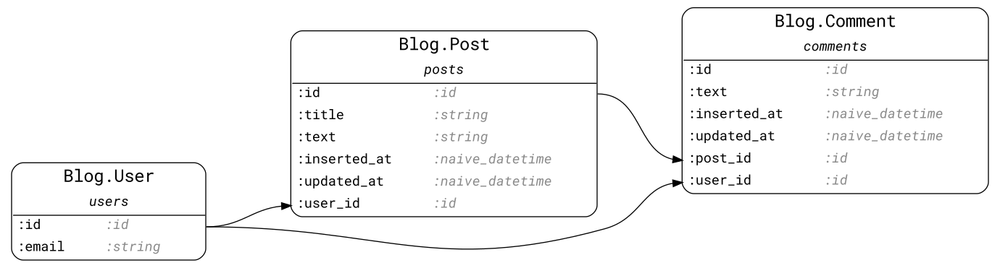

# Ecto.ERD

A mix task for generating an ERD (Entity Relationship Diagram) in various
formats for all Ecto schemas available in your project.

Supported formats:

* [DOT](https://en.wikipedia.org/wiki/DOT_(graph_description_language)) (default)
* [PlantUML](https://plantuml.com)
* [DBML](https://www.dbml.org/)
* [QuickDBD](https://www.quickdatabasediagrams.com)
* [Mermaid](https://mermaid-js.github.io/mermaid/#/entityRelationshipDiagram)


<details>
  <summary>Definition of schemas</summary>

  ```elixir
  defmodule Blog.Post do
    use Ecto.Schema

    schema "posts" do
      field(:title, :string)
      field(:text, :string)
      timestamps()
      belongs_to(:user, Blog.User)
      has_many(:comments, Blog.Comment)
    end
  end

  defmodule Blog.Comment do
    use Ecto.Schema

    schema "comments" do
      field(:text, :string)
      timestamps()
      belongs_to(:post, Blog.Post)
      belongs_to(:user, Blog.User)
    end
  end

  defmodule Blog.User do
    use Ecto.Schema

    schema "users" do
      field(:email, :string)
      has_many(:posts, Blog.Post)
      has_many(:comments, Blog.Comment)
    end
  end
  ```

</details>

## Installation

The package can be installed by adding `ecto_erd` to your list of dependencies
in `mix.exs`:

```elixir
def deps do
  [
    {:ecto_erd, "~> 0.5", only: :dev}
  ]
end
```

## Usage

Just run:

```sh
mix ecto.gen.erd
```

The command above produces a file in DOT format which can be converted to an
image using `graphviz` utility:

```sh
dot -Tpng ecto_erd.dot -o erd.png
```

Configuration is possible via `.ecto_erd.exs` file.
The docs can be found at [https://hexdocs.pm/ecto_erd](https://hexdocs.pm/ecto_erd).
Configuration examples and output for a couple of open-source projects can be
found in EXAMPLES group of PAGES section.
