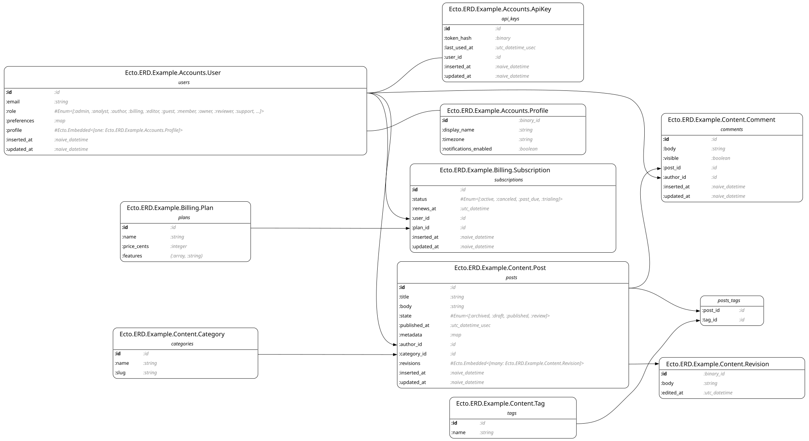
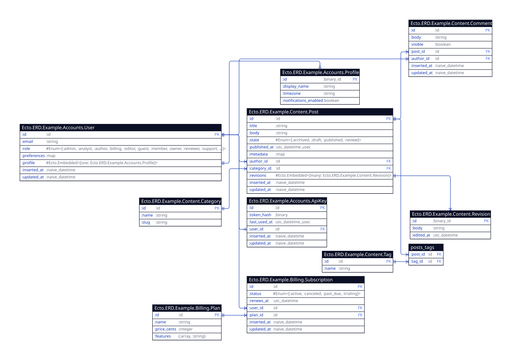
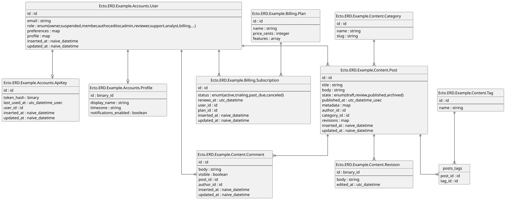

# Ecto.ERD

[](https://hex.pm/packages/ecto_erd)

A mix task for generating an ERD (Entity-Relationship Diagram) in various
formats for all Ecto schemas in your project.

Supported formats:

* [DOT](https://en.wikipedia.org/wiki/DOT_(graph_description_language)) (default)
* [PlantUML](https://plantuml.com)
* [DBML](https://www.dbml.org/)
* [QuickDBD](https://www.quickdatabasediagrams.com)
* [Mermaid](https://mermaid-js.github.io/mermaid/#/entityRelationshipDiagram)
* [D2](https://d2lang.com)

## Example

### DOT



<details>
  <summary>D2 output</summary>

  
</details>

<details>
  <summary>PlantUML output</summary>

  
</details>

All diagrams are generated from the repository's
[sample schemas](https://github.com/fuelen/ecto_erd/blob/main/dev/example_schemas.ex).

## Installation

The package can be installed by adding `ecto_erd` to your list of dependencies
in `mix.exs`:

```elixir
def deps do
  [
    {:ecto_erd, "~> 0.6", only: :dev}
  ]
end
```

## Usage

Just run:

```sh
mix ecto.gen.erd
```

The command above produces a DOT file, which you can convert to an
image using the Graphviz utility:

```sh
dot -Tpng ecto_erd.dot -o erd.png
```

Configuration is possible via the `.ecto_erd.exs` file.
The docs can be found at [https://hexdocs.pm/ecto_erd](https://hexdocs.pm/ecto_erd).
Configuration examples and sample output can be found on the
[Examples](https://hexdocs.pm/ecto_erd/examples.html) page.

## Troubleshooting

Trying to run `ecto_erd` in an umbrella project? You might see this error:

```
$ mix ecto.gen.erd
** (RuntimeError) Unable to detect `:otp_app`, please specify it explicitly
```

The easiest solution is to run the command on one of the apps in the `apps/` directory. Another option is to create a configuration file and specify the `:otp_app`. See the [docs for details](https://hexdocs.pm/ecto_erd/Mix.Tasks.Ecto.Gen.Erd.html#module-configuration-file).
